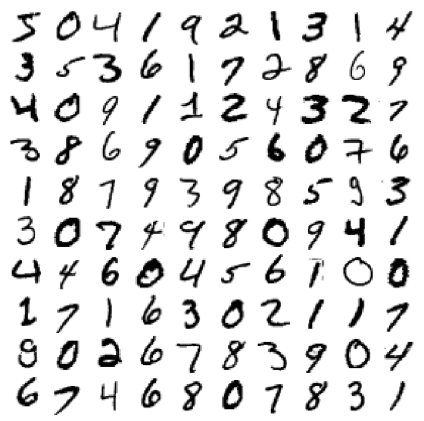

# About MNIST Dataset

- MNIST['data'] -> has independent data and MNIST['data'] -> has dependant labels
- shape:
  - x.shape = (70000, 784) -> has 28x28 pixel images hence the 784
  - y.shape = (70000, )
- Preview of images:
  
- Train - Test split - (60,000, 10,000) (85.7% training data and 14.3% testing data)
  - Shuffled the training data

# Training a binary Classifier and evaluating it

- we trained a data using SGDClassifier - Logistic Regression with SGD just to identify 5

## CV 
- CV result: array([0.93565, 0.96645, 0.9624 ])
- it has over 90% accuracy! This is simply because only about 10% of the images are 5s, so if you always guess that an image is not a 5, you will be right about 90% of the time
- Better solution for evaluation - confusion matrix

## Confusion matrix
- Result:
  - True Negatives (TN): 52,595 (Correctly predicted as 0)
  - False Positives (FP): 1,984 (Actual 0, but predicted as 1)
  - False Negatives (FN): 983 (Actual 1, but predicted as 0)
  - True Positives (TP): 4,438 (Correctly predicted as 1)

